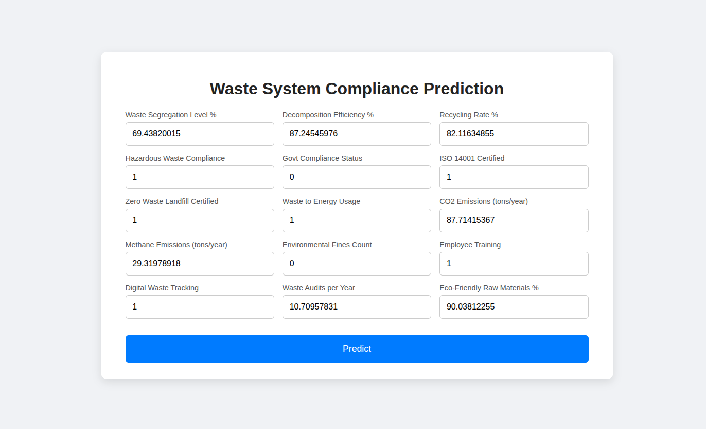
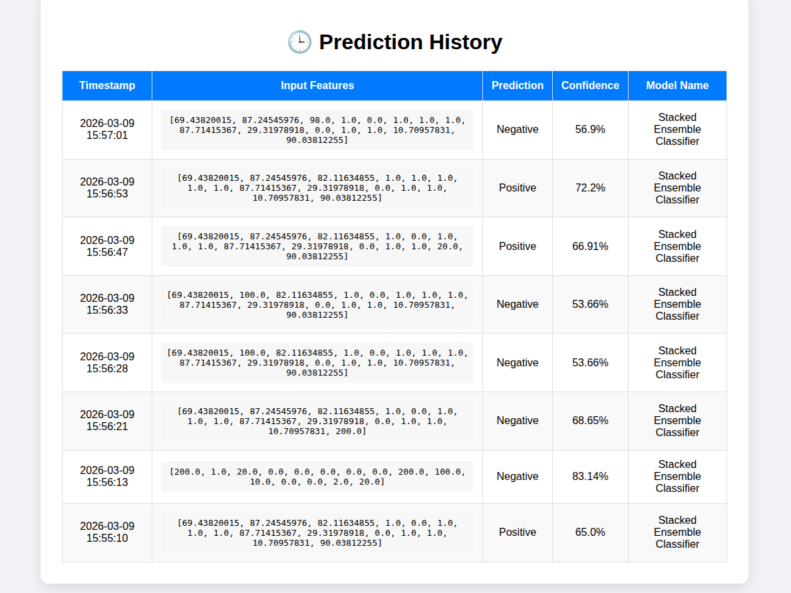

# Industrial Waste Compliance Detector


A machine learning project to detect whether industrial facilities have the necessary waste decomposition systems, ensuring environmental compliance.


## Tech Stack

- Python
- (Potentially) Scikit-learn for data analysis

##  Getting Started

### Prerequisites

- Python 3.9 or higher
- `pip` package manager


### Installation

1.  **Clone the repository:**
    ```sh
    git clone https://github.com/Shankar-CSE/Industrial-Waste-Compliance-Detector.git
    cd Industrial-Waste-Compliance-Detector
    ```

2.  **Running**
    Open bash shell and move to the diretory 
    then run this:
    ```
    ./run.bat
    ```
## open site in http://127.0.0.1:5000/

## Screenshots





## 📂 Project Structure
```
Industrial-Waste-Compliance-Detector/
├── data/                   # Directory for datasets
├── models/                 # Directory for trained models
├── preprocessing           
│   └── preprocessing.py       # Data preprocessing scripts    
├── training/
│   └── train.py            # Model training scripts
├── templates/
│   └── index.html            # home page
│   └── history.html            # Retrive logs from database
├──app.py
├── requirements.txt        # Project dependencies
├── README.md               # Project documentation
   
```


## 🤝 Contributing

Contributions are welcome! If you'd like to contribute to this project, please follow these steps:

1.  Fork the repository.
2.  Create a new branch (`git checkout -b feature/your-feature-name`).
3.  Make your changes and commit them (`git commit -m 'Add some feature'`).
4.  Push to the branch (`git push origin feature/your-feature-name`).
5.  Open a Pull Request.

Please make sure to update tests as appropriate.


